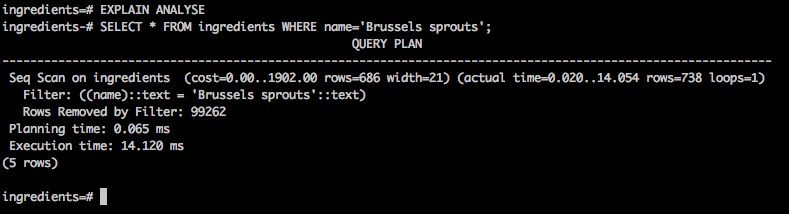
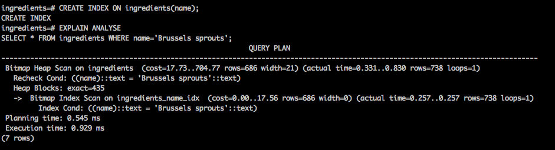
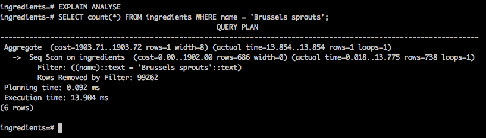
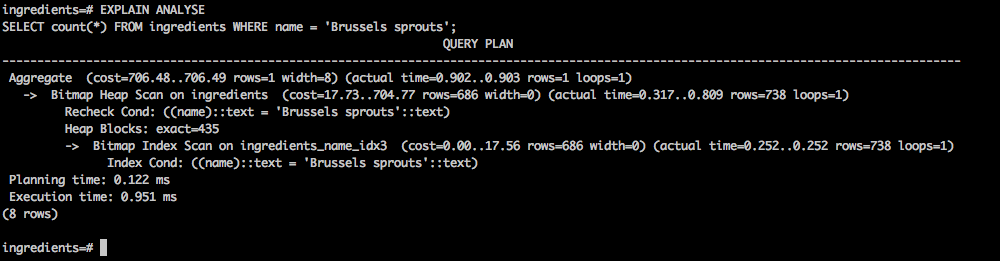
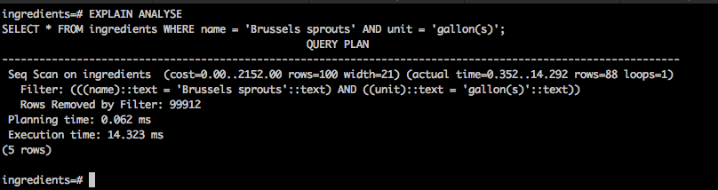
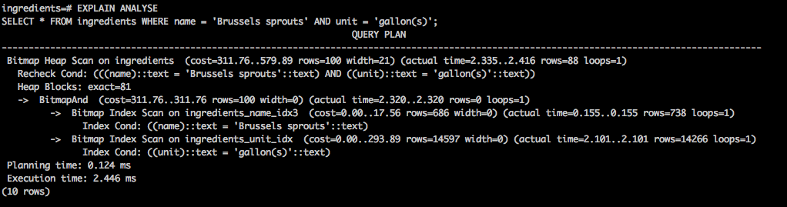
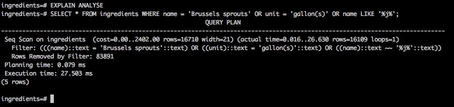
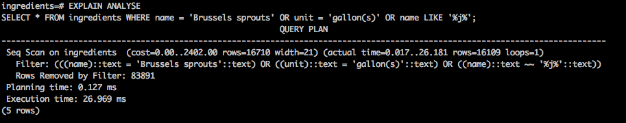

Query | Before  | After
----- | ------- | -------
Find all rows that have an ingredient name of Brussels sprouts. |   | 
Calculate the total count of rows of ingredients with a name of Brussels sprouts. |   | 
Find all Brussels sprouts ingredients having a unit type of gallon(s). |   | 
Find all rows that have a unit type of gallon(s), a name of Brussels sprouts or has the letter j in it. |   | 

